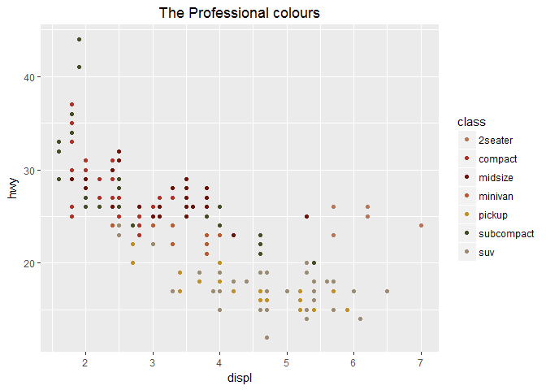
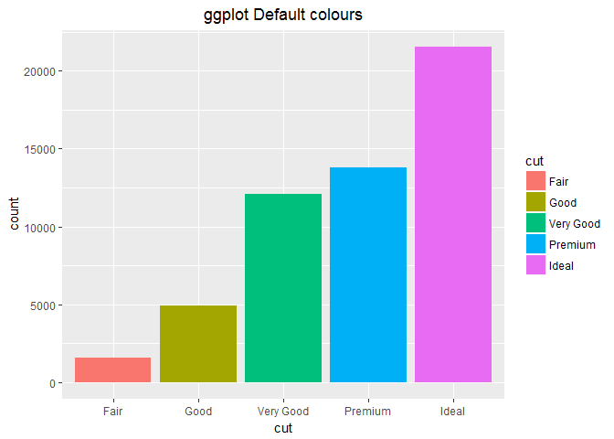
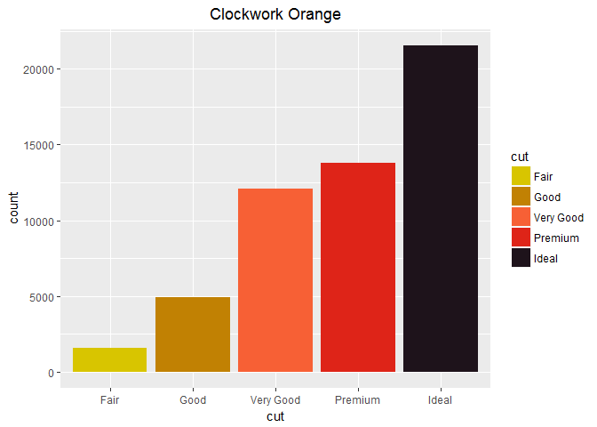
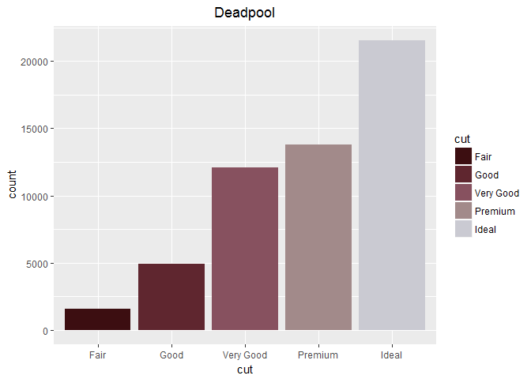
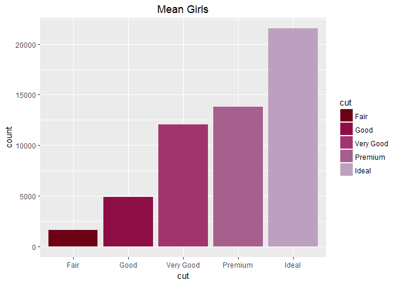
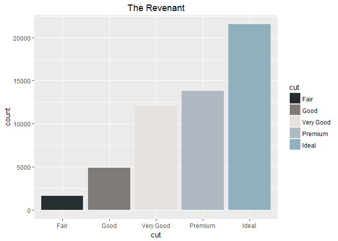
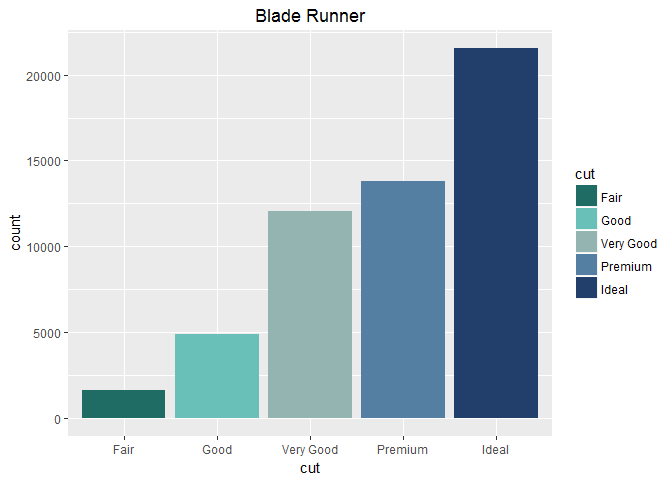
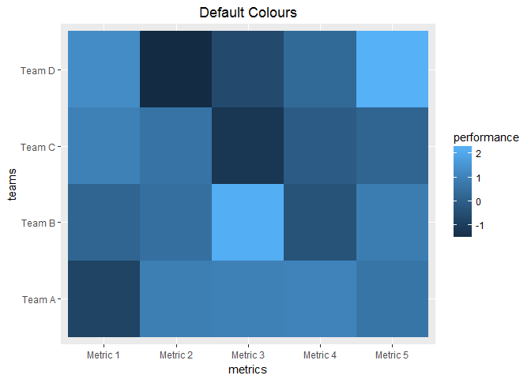
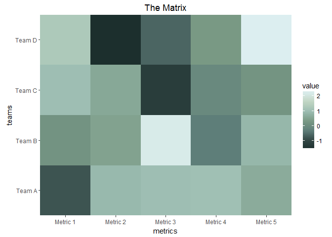

# filmpalettes

## Goal of Package
The goal is to create a package similar to the \href{https://github.com/karthik/wesanderson} {wesanderson package}. where you can give your plots a colour theme inspired by film palettes. 

Film Palettes
-------------

There are a handful of colour palettes inspired by famous films movies all derived from this Esquire article: .

Here are all the availble palettes:


Examples
========

Plot the mtcars package. You will need to add an aditional line in the ggplot to specify which palette to use.

The Professional
----------------


``` r
ggplot(data=mpg)+geom_point(mapping=aes(x=displ, y=hwy, color=class))+ 
  scale_color_manual(values = film_palette("TheProfessional")) +
  ggtitle("The Professional colours")+
  theme(plot.title = element_text(hjust = 0.5))
```



Play around with the diamonds data set. We will plot the same graph but with various movie palettes.

Default:

``` r
ggplot(data=diamonds)+
  geom_bar(mapping=aes(cut, fill=cut))+
  ggtitle("ggplot Default colours")+
  theme(plot.title = element_text(hjust = 0.5))
```



Clockwork Orange
----------------


``` r
ggplot(data=diamonds)+
  geom_bar(mapping=aes(cut, fill=cut))+ 
  scale_fill_manual(values = film_palette("ClockworkOrange"))+
   ggtitle("Clockwork Orange")+
  theme(plot.title = element_text(hjust = 0.5))
```



Deadpool
--------


``` r
ggplot(data=diamonds)+
  geom_bar(mapping=aes(cut, fill=cut))+ 
  scale_fill_manual(values = film_palette("Deadpool"))+
   ggtitle("Deadpool")+
  theme(plot.title = element_text(hjust = 0.5))
```



Mean Girls
----------


``` r
ggplot(data=diamonds)+geom_bar(mapping=aes(cut, fill=cut))+ 
   scale_fill_manual(values = film_palette("MeanGirls"))+
   ggtitle("Mean Girls")+
  theme(plot.title = element_text(hjust = 0.5))
```



The Revenant
------------


``` r
ggplot(data=diamonds)+geom_bar(mapping=aes(cut, fill=cut))+ 
   scale_fill_manual(values = film_palette("TheRevenant"))+
   ggtitle("The Revenant")+
  theme(plot.title = element_text(hjust = 0.5))
```



Blade Runner
------------


``` r
ggplot(data=diamonds)+geom_bar(mapping=aes(cut, fill=cut))+ 
   scale_fill_manual(values = film_palette("BladeRunner"))+
   ggtitle("Blade Runner")+
  theme(plot.title = element_text(hjust = 0.5))
```



Continous Example
=================

Making a heat map using this example: <https://www.r-bloggers.com/how-to-make-a-simple-heatmap-in-ggplot2/>

Create a data frame:

``` r
df.team_data <- expand.grid(teams = c("Team A", "Team B", "Team C", "Team D")
                           ,metrics = c("Metric 1", "Metric 2", "Metric 3", "Metric 4", "Metric 5")
                           )

# add variable: performance
set.seed(41)
df.team_data$performance <- rnorm(nrow(df.team_data))
```

``` r
#Plot Normally
ggplot(data = df.team_data, aes(x = metrics, y = teams)) +
  geom_tile(aes(fill = performance)) +
   ggtitle("Default Colours")+
  theme(plot.title = element_text(hjust = 0.5))
```



The Matrix
----------


``` r
pal <- film_palette("TheMatrix", 100, type = "continuous")

ggplot(data = df.team_data, aes(x = metrics, y = teams, fill = value)) +
  geom_tile(aes(fill = performance)) + 
  scale_fill_gradientn(colours = pal) + 
  scale_x_discrete(expand = c(0, 0)) +
  scale_y_discrete(expand = c(0, 0)) + 
  coord_equal()+
   ggtitle("The Matrix")+
  theme(plot.title = element_text(hjust = 0.5))
```


